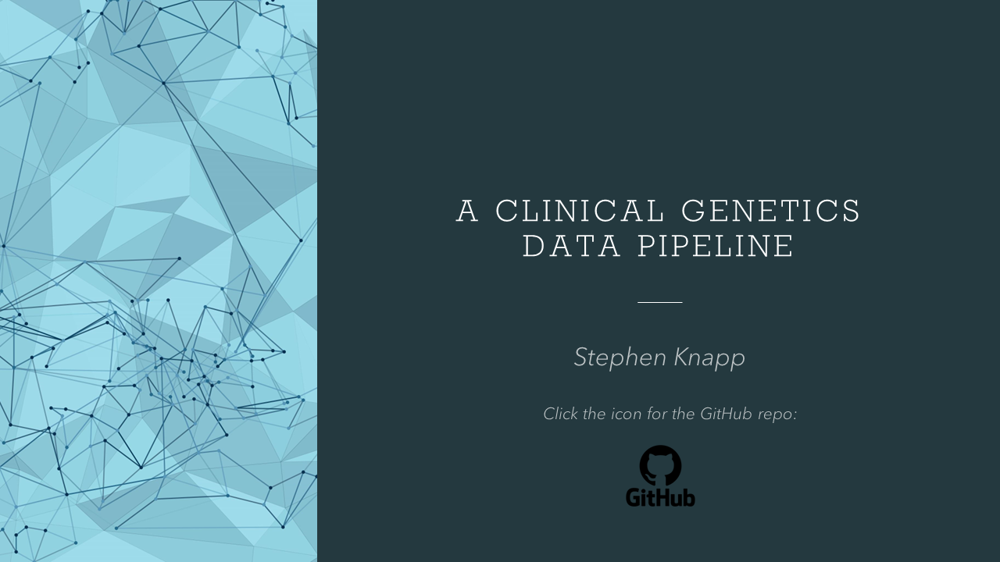
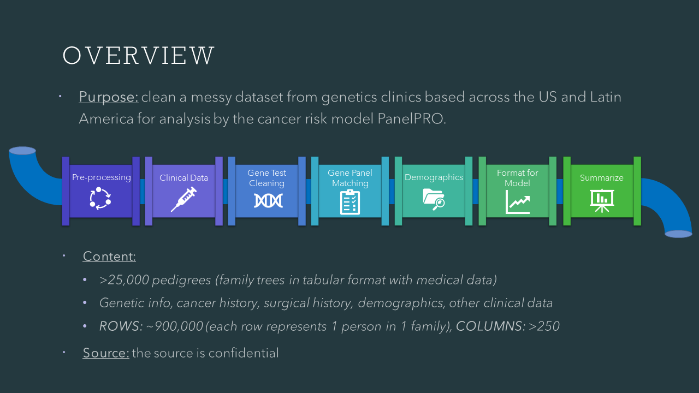
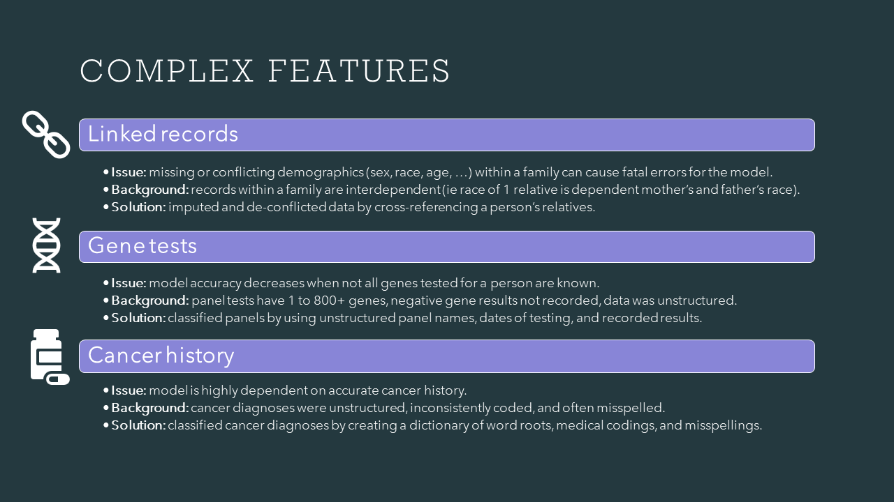
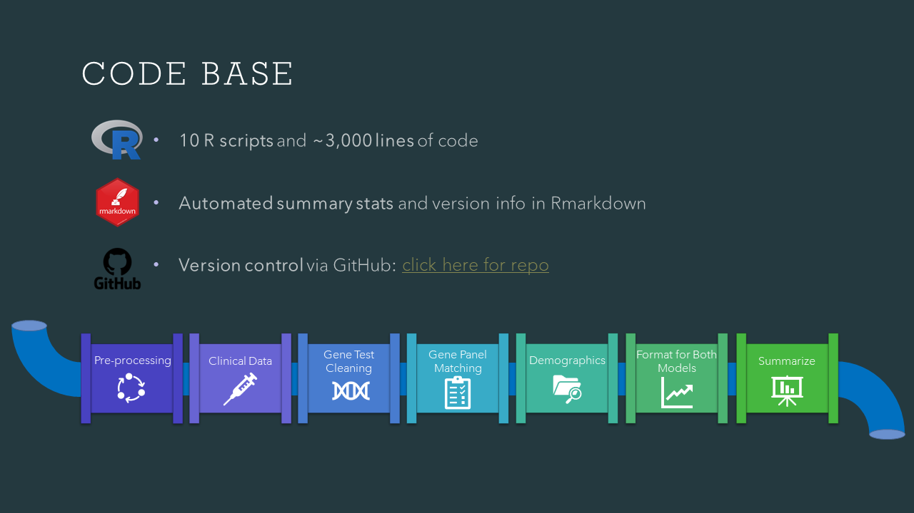

# A Clinical Genetics Data Pipeline

This repository contains a complex data cleaning pipeline for a clinical genetics dataset that I wrote in R. Its purpose is to showcase my coding, data curation and problem solving skills as part of my data science portfolio. The slides below will walk you through an overview of the project and solutions I developed to address dataset complexities.

Note: due to confidentiality, the source information and data have been omitted from the repo.

